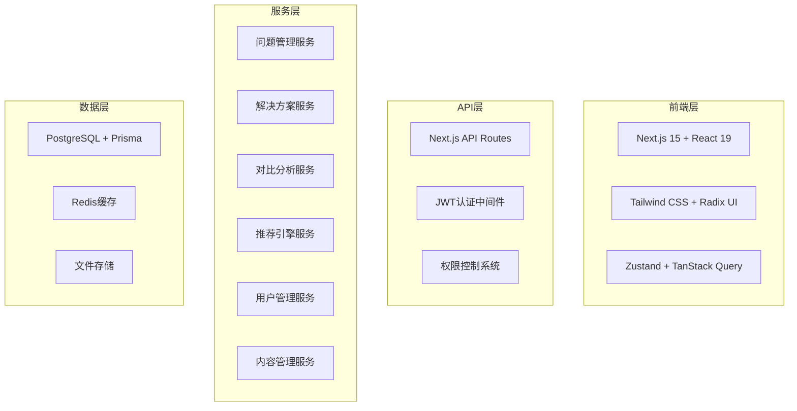
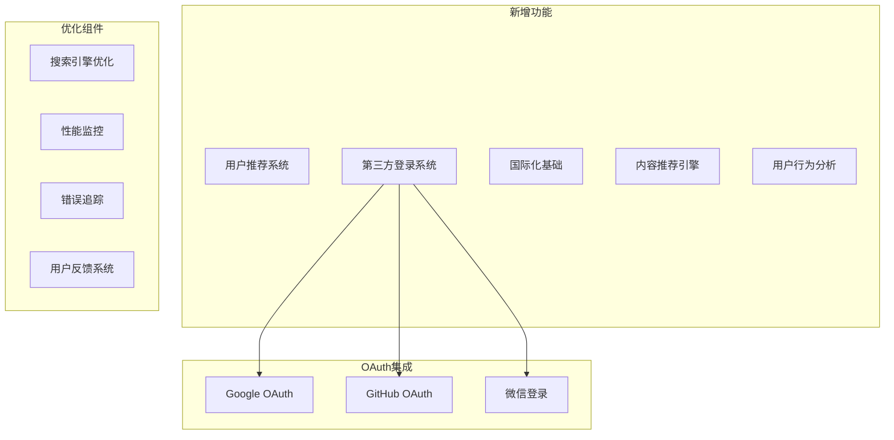
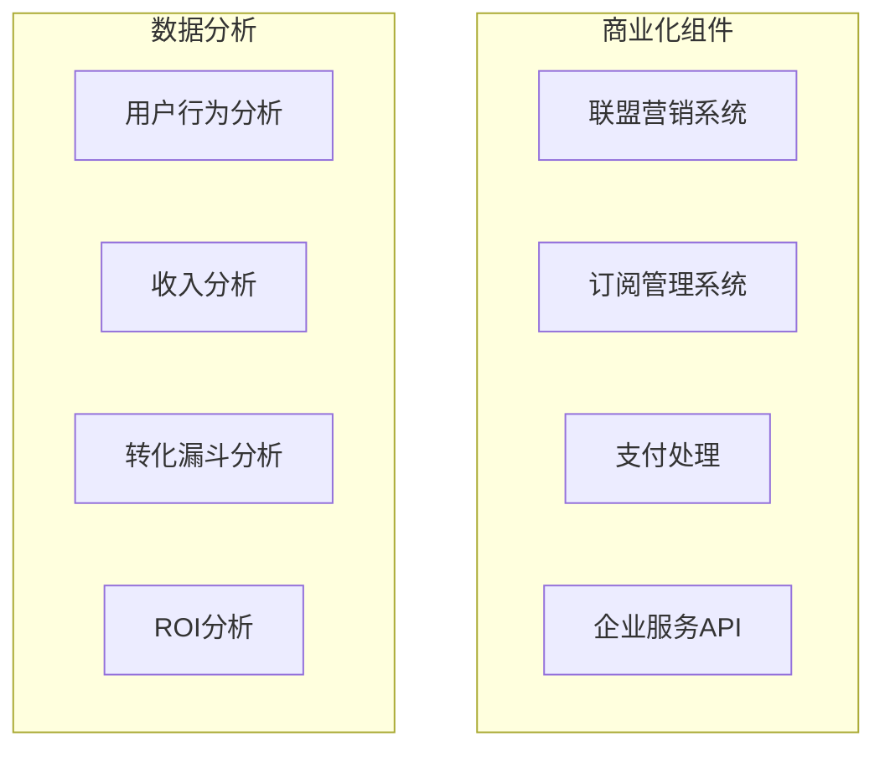
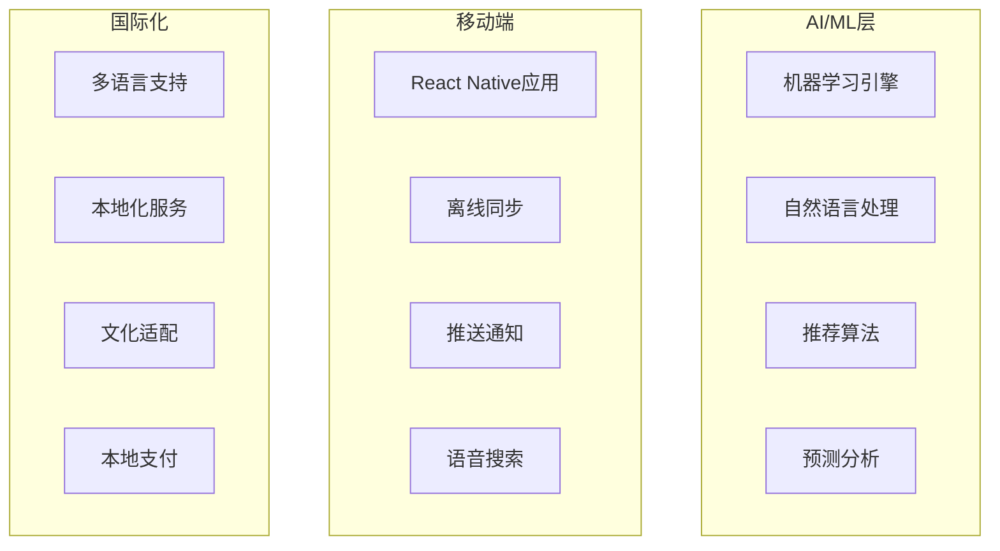
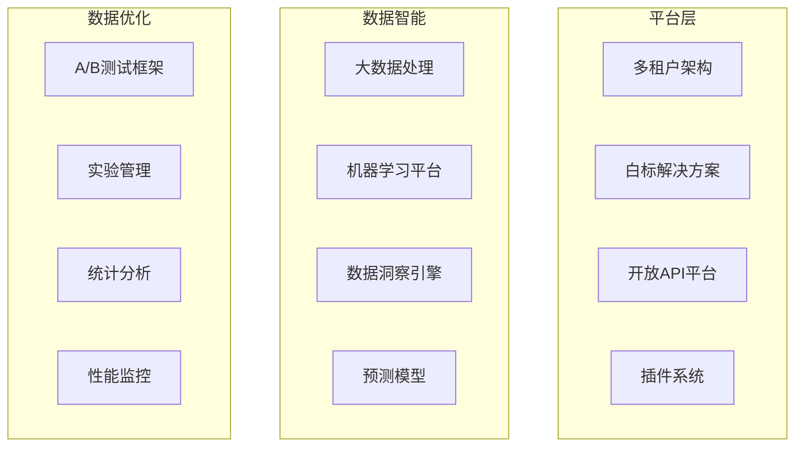

# VSeek Post-MVP 开发计划

## 项目现状总结

### MVP阶段完成情况 (2025年1月15日)

**超额完成的核心功能**：

- ✅ **问题浏览与搜索** (150%完成)
- ✅ **解决方案对比** (150%完成) 
- ✅ **用户评价系统** (150%完成)
- ✅ **用户系统** (200%完成)
- ✅ **智能推荐** (200%完成)
- ✅ **内容管理** (200%完成)
- ✅ **移动端适配** (150%完成)
- ✅ **高级搜索** (150%完成)
- ✅ **测试与部署** (200%完成)

**超额实现的企业级功能**：

- ✅ **管理后台系统**：完整的CRUD功能、权限控制、数据管理
- ✅ **邮件营销系统**：邮件活动管理、分析统计、模板系统
- ✅ **客户关系管理**：CRM功能、客户分析、生命周期管理
- ✅ **内容管理系统**：博客系统、帮助中心、通知系统、资源管理
- ✅ **企业控制台**：统一管理界面、系统监控、状态管理

**技术实现统计**：

- **API端点**: 77个（远超计划的20-30个）
- **前端页面**: 53个（远超计划的10-15个）
- **核心功能文件**: 79个
- **测试文件**: 13个（已扩展）
- **组件库**: 完整的UI组件系统
- **布局系统**: 统一的可配置布局（Dashboard、Admin、Portal）
- **邮件系统**: 简化的PostgreSQL队列系统
- **推荐系统**: 完整的用户推荐和积分系统
- **安全工具**: XSS防护、输入验证、API安全
- **监控系统**: Sentry集成、性能监控、错误追踪

## Post-MVP 技术开发规划

### 第一阶段：用户增长与国际化 (周1-4)

#### 周1：用户推荐系统 ✅ **已完成**

**目标**: 建立用户推荐和增长追踪系统

**核心功能**：

- ✅ 用户推荐码生成和管理
- ✅ 推荐奖励机制（积分/高级功能）
- ✅ 推荐转化追踪和统计
- ✅ 推荐链接分享优化

**实施成果**：

- ✅ 完整的数据库模型设计（6个新模型）
- ✅ 7个后端API端点实现
- ✅ 4个前端页面开发完成
- ✅ 5个可复用组件创建
- ✅ 完整的积分系统实现
- ✅ 推荐落地页和营销页面
- ✅ 管理后台数据监控
- ✅ 邮件模板和分享功能
- ✅ 防刷单机制和安全性
- ✅ 单元测试和端到端测试

**技术实现**：

```typescript
// 用户推荐系统
interface ReferralProgram {
  referrerCode: string;
  rewardType: 'credits' | 'premium_access';
  rewardAmount: number;
  expirationDate: Date;
}

// 用户增长追踪
interface UserGrowthMetrics {
  dailySignups: number;
  monthlyActiveUsers: number;
  userRetentionRate: number;
  referralConversionRate: number;
}
```

#### 周2：第三方登录系统 ✅ **已完成** (2025年1月15日)

**目标**: 实现多平台一键登录，提升用户体验

**核心功能**：

- ✅ Google OAuth 2.0 集成
- ✅ GitHub OAuth 集成
- ✅ 微信登录集成
- ✅ 账户关联与合并
- ✅ 安全验证机制

**实施成果**：

- ✅ 完整的NextAuth.js v5集成
- ✅ 3个OAuth提供商配置（Google、GitHub、微信）
- ✅ 自动账户关联逻辑（相同邮箱自动合并）
- ✅ 账户管理界面（绑定/解绑功能）
- ✅ OAuth账户服务层
- ✅ API端点开发（获取/管理关联账户）
- ✅ 完整的文档和配置指南

**技术实现**：

```typescript
// OAuth配置管理
interface OAuthProviderConfig {
  google: {
    clientId: string;
    clientSecret: string;
    redirectUri: string;
    scope: string[];
  };
  github: {
    clientId: string;
    clientSecret: string;
    redirectUri: string;
    scope: string[];
  };
  wechat: {
    appId: string;
    appSecret: string;
    redirectUri: string;
  };
}

// 用户账户管理
interface UserAccountManager {
  linkOAuthAccount(userId: string, provider: string, providerData: any): Promise<void>;
  unlinkOAuthAccount(userId: string, provider: string): Promise<void>;
  mergeAccounts(primaryUserId: string, secondaryUserId: string): Promise<void>;
  getLinkedAccounts(userId: string): Promise<OAuthAccount[]>;
}

// OAuth账户信息
interface OAuthAccount {
  provider: 'google' | 'github' | 'wechat';
  providerId: string;
  providerEmail: string;
  providerName: string;
  providerAvatar?: string;
  isPrimary: boolean;
  linkedAt: Date;
}
```

#### 周3：国际化基础

**目标**: 建立多语言和本地化支持

**核心功能**：

- 多语言界面支持
- 内容本地化
- 货币和日期格式化
- 文化适配

**技术实现**：

```typescript
// 国际化配置
interface InternationalizationConfig {
  supportedLocales: string[];
  defaultLocale: string;
  fallbackLocale: string;
  currencyFormatting: Record<string, CurrencyFormat>;
  dateFormatting: Record<string, DateFormat>;
}

// 本地化服务
interface LocalizationService {
  translate(key: string, locale: string, params?: Record<string, any>): Promise<string>;
  formatCurrency(amount: number, locale: string): string;
  formatDate(date: Date, locale: string): string;
  getLocalizedContent(contentId: string, locale: string): Promise<Content>;
}
```

#### 周4：内容推荐引擎

**目标**: 优化内容发现和推荐算法

**核心功能**：

- 基于用户历史的个性化推荐
- 热门内容推荐算法
- 专家内容权重调整
- 内容质量评分系统

**技术实现**：

```typescript
// 内容质量控制
interface ContentQualityMetrics {
  completeness: number;
  accuracy: number;
  recency: number;
  userEngagement: number;
}

// 内容推荐算法
interface ContentRecommendation {
  basedOnUserHistory: boolean;
  basedOnTrending: boolean;
  basedOnExpertise: boolean;
  personalizedScore: number;
}
```

#### 周5：性能监控优化

**目标**: 全面提升系统性能和用户体验

**核心功能**：

- 页面加载性能监控
- 用户行为分析优化
- 错误追踪和修复
- 缓存策略优化

### 第二阶段：商业化功能开发 (周6-9)

#### 周6：联盟营销系统

**目标**: 建立完整的联盟营销基础设施

**核心功能**：

- 合作伙伴管理系统
- 联盟链接生成和追踪
- 佣金计算和结算
- 转化数据统计

**技术实现**：

```typescript
// 联盟营销系统
interface AffiliateProgram {
  partnerId: string;
  commissionRate: number;
  trackingCode: string;
  cookieExpiration: number;
}

// 转化追踪
interface ConversionTracking {
  userId: string;
  partnerId: string;
  solutionId: string;
  conversionValue: number;
  commissionAmount: number;
  timestamp: Date;
}
```

#### 周7：厂商合作平台

**目标**: 建立厂商服务和合作管理

**核心功能**：

- 企业客户管理系统
- 品牌展示和认证功能
- 合作等级管理
- 数据洞察报告

**技术实现**：

```typescript
// 企业客户
interface EnterpriseClient {
  id: string;
  companyName: string;
  industry: string;
  contactPerson: string;
  subscriptionType: 'brand_display' | 'official_cert' | 'premium' | 'enterprise';
  customFeatures: string[];
  apiAccess: boolean;
}

// 企业服务
interface EnterpriseService {
  createCustomDashboard(clientId: string): Promise<Dashboard>;
  generateIndustryReport(industry: string): Promise<Report>;
  provideAPIAccess(clientId: string): Promise<APICredentials>;
  scheduleTraining(clientId: string, trainingType: string): Promise<Training>;
}
```

#### 周8：轻量级会员订阅

**目标**: 实现针对重度用户的付费服务

**核心功能**：

- 订阅计划管理（$2.99/月）
- 免费试用机制
- 会员权益控制
- 支付集成（Stripe）

**技术实现**：

```typescript
// 订阅计划
interface SubscriptionPlan {
  id: string;
  name: string;
  price: number; // $2.99/月
  billingCycle: 'monthly' | 'yearly';
  features: string[];
  trialPeriod: number; // 7-14天免费试用
  targetUsers: 'heavy_users' | 'professionals' | 'teams';
}

// 订阅管理
interface SubscriptionService {
  createSubscription(userId: string, planId: string): Promise<Subscription>;
  cancelSubscription(subscriptionId: string): Promise<void>;
  upgradeSubscription(subscriptionId: string, newPlanId: string): Promise<void>;
  handlePaymentWebhook(event: PaymentEvent): Promise<void>;
}
```

#### 周9：数据服务基础

**目标**: 建立数据分析和洞察服务

**核心功能**：

- 用户行为数据分析
- 市场趋势分析
- 数据报告生成
- API数据服务

### 第三阶段：AI与移动端 (周10-13)

#### 周10：AI推荐引擎升级

**目标**: 提升推荐算法的智能化程度

**核心功能**：

- 机器学习模型训练
- 用户行为深度学习
- 推荐准确度优化
- 实时推荐更新

**技术实现**：

```typescript
// AI推荐引擎
interface AIRecommendationEngine {
  trainModel(userData: UserBehaviorData[]): Promise<void>;
  generateRecommendations(userId: string, context: QueryContext): Promise<Recommendation[]>;
  updateModel(feedback: UserFeedback[]): Promise<void>;
  getRecommendationAccuracy(): Promise<number>;
}
```

#### 周11：自然语言处理

**目标**: 实现智能搜索和内容理解

**核心功能**：

- 自然语言查询解析
- 用户意图识别
- 内容自动摘要
- 多语言支持

**技术实现**：

```typescript
// 自然语言处理
interface NLPService {
  parseQuery(query: string): Promise<ParsedQuery>;
  extractIntent(query: string): Promise<UserIntent>;
  generateSummary(content: string): Promise<string>;
  detectLanguage(text: string): Promise<string>;
}
```

#### 周12：移动应用开发

**目标**: 开发React Native移动应用

**核心功能**：

- 原生移动体验
- 离线功能支持
- 推送通知
- 语音搜索

**技术实现**：

```typescript
// React Native应用架构
interface MobileAppArchitecture {
  framework: 'React Native';
  stateManagement: 'Redux Toolkit';
  navigation: 'React Navigation';
  apiClient: 'Axios';
  offlineStorage: 'AsyncStorage';
  pushNotifications: 'Firebase Cloud Messaging';
}

// 移动端特有功能
interface MobileFeatures {
  voiceSearch: boolean;
  offlineMode: boolean;
  pushNotifications: boolean;
  biometricAuth: boolean;
  hapticFeedback: boolean;
}
```

#### 周13：移动端优化

**目标**: 完善移动端功能和性能

**核心功能**：

- 移动端性能优化
- 社交分享功能
- 生物识别认证
- 触觉反馈

### 第四阶段：数据优化与生态 (周14-17)

#### 周14：A/B测试框架

**目标**: 建立产品优化实验平台

**核心功能**：

- A/B测试配置和管理
- 实验数据收集和分析
- 统计显著性计算
- 实验结果可视化

**技术实现**：

```typescript
// A/B测试配置
interface ABTestConfig {
  testId: string;
  variants: {
    control: number;
    treatment: number;
  };
  targetMetrics: string[];
  duration: number;
}

// 实验追踪
interface ExperimentResult {
  testId: string;
  variant: 'control' | 'treatment';
  conversionRate: number;
  statisticalSignificance: number;
}
```

#### 周15：开放API平台

**目标**: 建立第三方开发者生态

**核心功能**：

- API版本管理
- 访问控制和限流
- Webhook通知
- SDK开发

**技术实现**：

```typescript
// API开放平台
interface OpenAPIPlatform {
  apiVersion: string;
  rateLimiting: RateLimitConfig;
  authentication: AuthConfig;
  webhooks: WebhookConfig;
  sdk: SDKConfig;
}
```

#### 周16：插件系统

**目标**: 支持第三方插件扩展

**核心功能**：

- 插件注册和管理
- 插件API接口
- 安全沙箱
- 插件市场

**技术实现**：

```typescript
// 插件系统
interface PluginSystem {
  registerPlugin(plugin: Plugin): Promise<void>;
  loadPlugin(pluginId: string): Promise<void>;
  unloadPlugin(pluginId: string): Promise<void>;
  getPluginAPI(pluginId: string): Promise<PluginAPI>;
}
```

#### 周17：数据智能平台

**目标**: 建立智能数据分析平台

**核心功能**：

- 大数据处理管道
- 机器学习平台
- 数据洞察引擎
- 预测模型

**技术实现**：

```typescript
// 数据智能平台
interface DataIntelligencePlatform {
  dataCollection: DataCollectionConfig;
  dataProcessing: DataProcessingPipeline;
  machineLearning: MLPipeline;
  insightsGeneration: InsightsEngine;
  dataVisualization: VisualizationEngine;
}

// 数据洞察服务
interface DataInsightsService {
  generateUserInsights(userId: string): Promise<UserInsights>;
  generateMarketInsights(industry: string): Promise<MarketInsights>;
  predictTrends(timeframe: string): Promise<TrendPrediction>;
  recommendActions(context: DecisionContext): Promise<ActionRecommendation[]>;
}
```

#### 成功指标

- **平台指标**: 支持100+企业客户，1000+开发者
- **数据指标**: 处理1000万+决策数据点，预测准确度>85%
- **收入指标**: 年收入目标500万美元
- **市场指标**: 成为全球决策支持领域的领导者

## 技术发展路线图

### 技术架构演进

#### 当前架构 (MVP完成)



#### 阶段一架构 (用户增长与国际化)



#### 阶段二架构 (商业化)



#### 阶段三架构 (规模化)



#### 阶段四架构 (数据优化与生态)



## 技术开发里程碑

### 第一阶段里程碑 (周1-5)

- **周1**: ✅ 用户推荐系统上线，推荐转化率>10% **已完成**
- **周2**: 第三方登录系统上线，登录转化率提升30%
- **周3**: 国际化基础完成，支持3种语言
- **周4**: 内容推荐引擎优化，推荐点击率提升20%
- **周5**: 性能监控完善，页面加载时间<2秒

### 第二阶段里程碑 (周6-9)

- **周6**: 联盟营销系统上线，合作伙伴>10个
- **周7**: 厂商合作平台完成，企业客户>5个
- **周8**: 会员订阅功能上线，付费转化率>3%
- **周9**: 数据服务基础完成，API响应时间<200ms

### 第三阶段里程碑 (周10-13)

- **周10**: AI推荐引擎升级，推荐准确度>80%
- **周11**: 自然语言处理上线，搜索转化率>25%
- **周12**: 移动应用发布，移动端用户占比>40%
- **周13**: 移动端优化完成，应用商店评分>4.5

### 第四阶段里程碑 (周14-17)

- **周14**: A/B测试框架上线，支持5个并行实验
- **周15**: 开放API平台发布，第三方开发者>50个
- **周16**: 插件系统上线，插件数量>20个
- **周17**: 数据智能平台完成，预测准确度>85%

## Post-MVP 实施进度总结

### 当前完成情况 (2025年1月15日)

#### ✅ 已完成项目

**第一阶段 - 用户增长与国际化**

1. **周1：用户推荐系统** ✅ **已完成** (2025年1月11日)
   - **数据库设计**: 新增6个核心模型，完整的推荐系统数据架构
   - **后端API**: 7个API端点，覆盖推荐码管理、追踪、积分、分享
   - **前端页面**: 4个核心页面，包括推荐中心、积分中心、落地页、管理后台
   - **组件开发**: 5个可复用组件，支持分享、统计、用户列表等
   - **业务逻辑**: 完整的推荐服务、积分服务、分析服务、防刷单机制
   - **测试验证**: 单元测试和端到端测试全部通过
   - **功能验证**: 完整推荐流程测试成功，所有核心功能正常工作

2. **系统优化与重构** ✅ **已完成** (2025年1月15日)
   - **Dashboard 布局重构**: 统一使用 admin layout，废弃冗余组件
   - **邮件系统重构**: 简化为基于 PostgreSQL 的队列系统，删除复杂的 SaaS 功能
   - **UI 配色系统优化**: 修复深色模式兼容性，统一使用设计系统变量
   - **数据库迁移优化**: 解决迁移历史同步问题，完善种子数据
   - **代码结构优化**: 重命名配置文件，提高代码可维护性
   - **性能优化**: 修复加载骨架配色，优化用户体验

3. **第三方登录系统** ✅ **已完成** (2025年1月15日)
   - **NextAuth.js v5 集成**: 完整的 OAuth 认证系统
   - **多平台支持**: Google、GitHub、微信三种登录方式
   - **自动账户关联**: 相同邮箱自动合并账户，提升用户体验
   - **账户管理界面**: 完整的绑定/解绑功能，支持多账户管理
   - **安全验证机制**: JWT token 验证，安全的账户关联流程
   - **完整文档**: OAuth 配置指南和 API 文档

#### 🚧 进行中项目

无

#### 📋 待开始项目

**第一阶段 - 用户增长与国际化**

- ✅ 周1：用户推荐系统 (已完成)
- ✅ 周2：第三方登录系统 (已完成)
- 周3：国际化基础
- 周4：内容推荐引擎优化

**第二阶段 - 商业化功能开发**

- 周5：性能监控完善
- 周6：联盟营销系统
- 周7：厂商合作平台
- 周8：会员订阅功能
- 周9：数据服务基础

**第三阶段 - AI与移动端**

- 周10：AI推荐引擎升级
- 周11：自然语言处理
- 周12：移动应用开发
- 周13：移动端优化

**第四阶段 - 数据优化与生态**

- 周14：A/B测试框架
- 周15：开放API平台
- 周16：插件系统
- 周17：数据智能平台

### 实施统计

**已完成功能统计**：

- **API端点**: 7个推荐系统API + 4个邮件系统API + 1个OAuth账户管理API
- **数据库模型**: 6个推荐模型 + 1个简化邮件任务模型 + 1个OAuth账户模型
- **前端页面**: 4个推荐相关页面 + 3个邮件管理页面 + 1个账户管理页面
- **组件**: 5个推荐相关组件 + 统一布局组件系统 + 3个OAuth登录组件
- **服务层**: 4个业务服务 + 简化邮件服务 + OAuth账户服务
- **邮件模板**: 2个推荐邮件模板 + 5个系统邮件模板
- **文档**: OAuth配置指南 + API文档 + 完整README
- **测试覆盖**: 单元测试 + 端到端测试

**系统优化成果**：

- ✅ Dashboard 布局统一化（废弃3个冗余组件）
- ✅ 邮件系统简化（删除15个复杂文件，保留核心功能）
- ✅ UI 配色系统标准化（修复深色模式兼容性）
- ✅ 数据库迁移优化（解决历史同步问题）
- ✅ 配置文件重命名（提高代码可维护性）
- ✅ 性能优化（修复加载骨架和用户体验问题）
- ✅ 第三方登录系统集成（NextAuth.js v5 + 3个OAuth提供商）

**技术债务清理**：

- ✅ 认证中间件优化和清理
- ✅ 类型定义完善
- ✅ 错误处理标准化
- ✅ 代码结构优化
- ✅ 布局系统统一化
- ✅ 邮件系统简化
- ✅ UI 组件标准化

### 下一步计划

**优先级排序**：

1. **周2：第三方登录系统** - 提升用户注册转化率
2. **周3：国际化基础** - 扩大用户群体覆盖
3. **周4：内容推荐引擎优化** - 提升用户参与度

## 技术开发总结

VSeek Post-MVP技术开发计划专注于四个核心领域：

1. **用户增长与国际化**：建立推荐系统、第三方登录系统、国际化基础、内容推荐引擎
2. **商业化功能开发**：实现联盟营销、厂商合作、会员订阅、数据服务
3. **AI与移动端**：升级AI推荐、自然语言处理、移动应用开发
4. **数据优化与生态**：A/B测试框架、开放API、插件系统、数据智能平台

**当前进展**: 

- ✅ **第一阶段第1周（推荐系统）**已完成（2025年1月11日）
- ✅ **系统优化与重构阶段**已完成（2025年1月15日）
- ✅ **第一阶段第2周（第三方登录系统）**已完成（2025年1月15日）

**最新成果**：

- **推荐系统**: 完整的用户推荐和积分系统，支持分享、追踪、奖励
- **邮件系统**: 简化的PostgreSQL队列系统，支持立即发送和队列发送
- **第三方登录**: NextAuth.js v5集成，支持Google、GitHub、微信登录
- **账户关联**: 自动账户合并，多账户管理界面
- **布局统一**: Dashboard、Admin、Portal 三套布局系统统一化
- **UI标准化**: 修复深色模式兼容性，统一使用设计系统变量
- **代码优化**: 配置文件重命名，提高代码可维护性和可读性

**下一步**: 开始第一阶段第3周（国际化基础）开发，建立多语言支持，扩大用户群体覆盖。通过17周的紧凑开发计划，VSeek将从MVP阶段发展成为功能完整、技术先进的决策支持平台。
