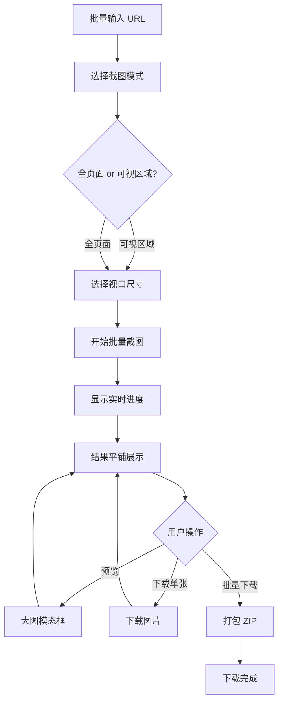

# Web Screenshot

> **开发状态**：📋 设计阶段  
> **计划版本**：v1.0.0  
> **依赖技术**：Puppeteer（已集成于 Theme Clone）  
> **预计开发周期**：1-2 周

专业的网页截图工具，支持批量截图、多视口尺寸、全页面/可视区域截图，并提供打包下载功能。

---

## 🎯 一、产品定位

### 一句话描述

> 批量截取网页截图，支持多设备视口、全页面模式，一键打包下载所有结果。

### 目标用户

- **前端开发者**：需要对比不同设备下的页面效果
- **UI/UX 设计师**：收集设计参考、制作设计规范文档
- **QA 测试人员**：记录 Bug 现场、生成测试报告
- **产品经理**：制作产品演示、竞品分析
- **自媒体/博主**：批量获取网站截图用于文章配图

### 核心价值主张

> "一次输入多个 URL，自动生成全设备截图，批量下载省时省力。"

### 与 Theme Clone 的关系

- **技术复用**：共享 Puppeteer 服务、视口配置、截图逻辑
- **UI 一致性**：复用 PortalLayout、Card 组件、表单风格
- **功能互补**：Theme Clone 侧重设计提取，Web Screenshot 侧重视觉记录
- **用户协同**：同一用户可能需要先截图再提取主题

---

## 🚀 二、开发进度规划

### Phase 1: MVP 核心功能（Week 1）

| 功能模块 | 优先级 | 预计时间 |
|---------|--------|----------|
| URL 批量输入 | P0 | Day 1 |
| 单页面截图（可视区域） | P0 | Day 1-2 |
| 视口尺寸选择 | P0 | Day 2 |
| 结果平铺展示 | P0 | Day 3 |
| 大图预览 | P1 | Day 3-4 |
| 基础 UI 组件 | P0 | Day 4-5 |

### Phase 2: 增强功能（Week 2）

| 功能模块 | 优先级 | 预计时间 |
|---------|--------|----------|
| 全页面截图 | P0 | Day 6 |
| 批量下载（ZIP） | P0 | Day 7-8 |
| 加载进度显示 | P1 | Day 8 |
| 错误处理 | P1 | Day 9 |
| 性能优化 | P2 | Day 10 |

### Phase 3: 高级功能（未来版本）

- [ ] 自定义视口尺寸
- [ ] 延迟截图（等待动画完成）
- [ ] 指定元素截图（CSS Selector）
- [ ] 截图水印
- [ ] 批量重命名规则
- [ ] 历史记录
- [ ] 云端存储

---

## 🧩 三、核心功能设计

### 1. 功能流程图



### 2. 功能模块详解

#### 🔹 A. URL 批量输入

**输入方式**：
1. **文本框输入**：
   - 每行一个 URL
   - 自动去重、去空行
   - 支持 `http://` 和 `https://`
   - 自动补全协议（输入 `example.com` → `https://example.com`）

2. **文件上传**（v2.0）：
   - 支持 `.txt` / `.csv` 文件
   - 自动解析 URL 列表

3. **快捷示例**：
   - 提供常用网站列表（GitHub、Vercel、Linear 等）
   - 一键填充

**验证规则**：
- URL 格式验证
- 最大数量限制（免费 10 个，付费 100 个）
- 去重处理
- 实时显示有效 URL 数量

#### 🔹 B. 截图模式选择

| 模式 | 说明 | 使用场景 | 技术实现 |
|------|------|----------|----------|
| **可视区域** | 仅截取浏览器窗口内容 | 快速预览、响应式对比 | `fullPage: false` |
| **全页面** | 截取整个网页（含滚动区域） | 完整记录、文档归档 | `fullPage: true` |

**默认**：可视区域（速度更快）

#### 🔹 C. 视口尺寸选择

| 设备类型 | 分辨率 | 说明 |
|---------|--------|------|
| **桌面端** | 1920 x 1080 | 标准显示器 |
| **平板** | 768 x 1024 | iPad 竖屏 |
| **手机** | 375 x 667 | iPhone SE/6/7/8 |

**多选支持**：
- 可同时勾选多个视口
- 批量生成不同设备的截图
- 示例：勾选"桌面 + 手机"，10 个 URL → 20 张截图

**自定义视口**（v2.0）：
- 输入自定义宽度和高度
- 保存常用尺寸

#### 🔹 D. 批量截图执行

**技术实现**：
```typescript
// 伪代码
async function batchScreenshot(urls: string[], options: ScreenshotOptions) {
  const results = [];
  
  for (const url of urls) {
    for (const viewport of options.viewports) {
      try {
        const screenshot = await captureScreenshot(url, {
          viewport,
          fullPage: options.fullPage,
        });
        
        results.push({
          url,
          viewport: viewport.name,
          screenshot: screenshot.base64,
          timestamp: new Date().toISOString(),
          status: 'success',
        });
        
        // 发送进度更新
        onProgress(results.length, urls.length * options.viewports.length);
      } catch (error) {
        results.push({
          url,
          viewport: viewport.name,
          error: error.message,
          status: 'failed',
        });
      }
    }
  }
  
  return results;
}
```

**进度显示**：
- 实时进度条（已完成 / 总数）
- 当前正在处理的 URL
- 预计剩余时间
- 成功/失败计数

**性能优化**：
- 并发控制（最多 3 个同时执行）
- 超时设置（每个截图最多 30 秒）
- 错误重试（失败后重试 1 次）

#### 🔹 E. 结果展示

**平铺网格布局**：
```
┌──────────────────────────────────────────┐
│  【结果列表】共 20 张截图                  │
│                                          │
│  ┌────────┐  ┌────────┐  ┌────────┐     │
│  │ 图1    │  │ 图2    │  │ 图3    │     │
│  │ GitHub │  │ Vercel │  │ Linear │     │
│  │ 桌面   │  │ 桌面   │  │ 桌面   │     │
│  │ [预览] │  │ [预览] │  │ [预览] │     │
│  │ [下载] │  │ [下载] │  │ [下载] │     │
│  └────────┘  └────────┘  └────────┘     │
│                                          │
│  ┌────────┐  ┌────────┐  ┌────────┐     │
│  │ 图4    │  │ 图5    │  │ 图6    │     │
│  │ GitHub │  │ Vercel │  │ Linear │     │
│  │ 手机   │  │ 手机   │  │ 手机   │     │
│  └────────┘  └────────┘  └────────┘     │
└──────────────────────────────────────────┘
```

**卡片信息**：
- 缩略图（200x150px）
- 网站名称（从 URL 提取）
- 视口类型（桌面/平板/手机）
- 截图时间
- 文件大小
- 操作按钮（预览、下载）

**筛选与排序**：
- 按设备类型筛选
- 按网站分组
- 按时间排序
- 失败的截图单独标记

#### 🔹 F. 大图预览

**模态框展示**：
- 全屏遮罩
- 原尺寸显示
- 缩放功能（放大/缩小）
- 左右切换（上一张/下一张）
- ESC 键关闭
- 显示元数据（URL、尺寸、时间）

**快捷键**：
- `←` / `→`：上一张 / 下一张
- `ESC`：关闭
- `+` / `-`：放大 / 缩小
- `Space`：全屏切换

#### 🔹 G. 批量下载

**ZIP 打包**：
```typescript
// 文件命名规则
{website-name}_{viewport}_{timestamp}.png

// 示例
github_desktop_20251103_143022.png
vercel_mobile_20251103_143025.png
linear_tablet_20251103_143028.png
```

**打包结构**：
```
screenshots_20251103_143022.zip
├── github/
│   ├── desktop.png
│   ├── tablet.png
│   └── mobile.png
├── vercel/
│   ├── desktop.png
│   └── mobile.png
└── manifest.json  # 元数据清单
```

**manifest.json**：
```json
{
  "created_at": "2025-11-03T14:30:22Z",
  "total_screenshots": 6,
  "screenshots": [
    {
      "url": "https://github.com",
      "viewport": "desktop",
      "resolution": "1920x1080",
      "fullPage": false,
      "filename": "github/desktop.png",
      "size": 245678
    }
  ]
}
```

**下载选项**：
- 全部下载（ZIP）
- 选择性下载（勾选后打包）
- 单张下载（PNG）

---

## 🎨 四、UI/UX 设计

### 1. 页面布局（参考 Theme Clone）

```
┌─────────────────────────────────────────────┐
│          Portal Header (导航栏)              │
└─────────────────────────────────────────────┘
┌─────────────────────────────────────────────┐
│      📸 Web Screenshot                      │
│      批量网页截图工具，支持多设备视口        │
└─────────────────────────────────────────────┘

┌─────────────────────────────────────────────┐
│         【输入区域 - 居中】                  │
│  ┌────────────────────────────────────┐    │
│  │ URL 列表（每行一个）                │    │
│  │ https://github.com                 │    │
│  │ https://vercel.com                 │    │
│  │ https://linear.app                 │    │
│  └────────────────────────────────────┘    │
│                                             │
│  ☑ 可视区域截图  ☐ 全页面截图              │
│                                             │
│  视口尺寸：                                 │
│  ☑ 桌面 (1920x1080)                        │
│  ☑ 平板 (768x1024)                         │
│  ☑ 手机 (375x667)                          │
│                                             │
│  [ 开始批量截图 ]                           │
└─────────────────────────────────────────────┘

┌─────────────────────────────────────────────┐
│  【进度显示】                                │
│  ████████░░ 80% (8/10)                      │
│  正在处理: https://github.com (桌面)        │
│  成功: 7 | 失败: 1 | 剩余时间: ~15s         │
└─────────────────────────────────────────────┘

┌─────────────────────────────────────────────┐
│  【结果区域】                                │
│  共 20 张截图 | 全选 [全部下载 ZIP]          │
│                                             │
│  ┌─────┐ ┌─────┐ ┌─────┐ ┌─────┐          │
│  │ 图1 │ │ 图2 │ │ 图3 │ │ 图4 │          │
│  │预览 │ │预览 │ │预览 │ │预览 │          │
│  │下载 │ │下载 │ │下载 │ │下载 │          │
│  └─────┘ └─────┘ └─────┘ └─────┘          │
└─────────────────────────────────────────────┘

┌─────────────────────────────────────────────┐
│          Portal Footer                      │
└─────────────────────────────────────────────┘
```

### 2. 核心组件设计

#### 组件列表

| 组件名 | 功能 | 复用来源 |
|--------|------|----------|
| `ScreenshotForm` | URL 输入 + 选项配置 | 参考 `ExtractForm` |
| `ProgressBar` | 批量进度显示 | 新组件 |
| `ScreenshotGrid` | 结果网格展示 | 参考 `ColorPalette` 网格 |
| `ScreenshotCard` | 单个截图卡片 | 新组件 |
| `ImagePreview` | 大图预览模态框 | 新组件 |
| `BatchDownload` | 批量下载面板 | 新组件 |

#### 组件设计细节

**ScreenshotForm.tsx**：
```tsx
interface ScreenshotFormProps {
  onSubmit: (urls: string[], options: ScreenshotOptions) => void;
  loading?: boolean;
}

interface ScreenshotOptions {
  fullPage: boolean;
  viewports: ViewportType[];
}

type ViewportType = 'desktop' | 'tablet' | 'mobile';
```

**ScreenshotCard.tsx**：
```tsx
interface ScreenshotCardProps {
  screenshot: ScreenshotResult;
  onPreview: () => void;
  onDownload: () => void;
  selected?: boolean;
  onSelect?: (selected: boolean) => void;
}
```

**ImagePreview.tsx**：
```tsx
interface ImagePreviewProps {
  images: ScreenshotResult[];
  currentIndex: number;
  onClose: () => void;
  onNext: () => void;
  onPrev: () => void;
}
```

### 3. 交互细节

**加载状态**：
- 表单提交后显示进度条
- 每完成一张截图，实时更新进度
- 失败的 URL 显示错误提示

**响应式适配**：
- 桌面：4 列网格
- 平板：3 列网格
- 手机：2 列网格

**视觉反馈**：
- 卡片 hover 显示操作按钮
- 选中状态高亮边框
- 下载按钮加载动画
- 成功/失败状态图标

---

## ⚙️ 五、技术架构

### 1. 技术栈（复用 Theme Clone）

| 层级 | 技术选型 | 说明 |
|------|---------|------|
| **前端框架** | Next.js 14 + React 18 | 复用现有项目 |
| **UI 库** | Tailwind CSS + shadcn/ui | 保持一致性 |
| **状态管理** | React useState + useReducer | 本地状态为主 |
| **后端 API** | Next.js API Routes | 统一技术栈 |
| **截图服务** | Puppeteer（已集成） | 共享服务 |
| **文件处理** | JSZip（浏览器端打包） | 客户端 ZIP |
| **数据库** | Prisma + PostgreSQL（可选） | 历史记录（v2.0） |

### 2. 项目结构

```bash
src/
├── features/
│   └── screenshot/                 # 新功能模块
│       ├── components/
│       │   ├── ScreenshotForm.tsx  # URL 输入表单
│       │   ├── ProgressBar.tsx     # 进度显示
│       │   ├── ScreenshotGrid.tsx  # 结果网格
│       │   ├── ScreenshotCard.tsx  # 截图卡片
│       │   ├── ImagePreview.tsx    # 大图预览
│       │   └── BatchDownload.tsx   # 批量下载
│       ├── services/
│       │   ├── screenshot.service.ts # 截图服务（复用 Theme Clone）
│       │   └── zip.service.ts       # ZIP 打包
│       ├── hooks/
│       │   ├── useScreenshot.ts     # 截图逻辑
│       │   └── useBatchDownload.ts  # 下载逻辑
│       ├── types/
│       │   └── index.ts             # 类型定义
│       └── utils/
│           ├── urlParser.ts         # URL 解析
│           └── fileNaming.ts        # 文件命名
├── app/
│   ├── screenshot/
│   │   └── page.tsx                 # 主页面
│   └── api/
│       └── screenshot/
│           ├── batch/
│           │   └── route.ts         # 批量截图 API
│           └── download/
│               └── route.ts         # 下载 API
```

### 3. 核心 API 设计

#### POST /api/screenshot/batch

**请求**：
```typescript
interface BatchScreenshotRequest {
  urls: string[];
  options: {
    fullPage: boolean;
    viewports: ViewportConfig[];
  };
}

interface ViewportConfig {
  name: 'desktop' | 'tablet' | 'mobile';
  width: number;
  height: number;
}
```

**响应**：
```typescript
interface BatchScreenshotResponse {
  id: string; // 批次 ID
  total: number;
  completed: number;
  results: ScreenshotResult[];
}

interface ScreenshotResult {
  url: string;
  viewport: string;
  screenshot: string; // Base64
  width: number;
  height: number;
  fileSize: number;
  timestamp: string;
  status: 'success' | 'failed';
  error?: string;
}
```

### 4. 数据模型（v2.0 - 可选）

```prisma
model ScreenshotBatch {
  id          String   @id @default(cuid())
  userId      String?
  urls        String[] // 原始 URL 列表
  options     Json     // 截图选项
  totalCount  Int
  successCount Int
  failedCount Int
  createdAt   DateTime @default(now())
  expiresAt   DateTime
  
  screenshots Screenshot[]
  user        User?    @relation(fields: [userId], references: [id])
  
  @@index([userId])
}

model Screenshot {
  id          String   @id @default(cuid())
  batchId     String
  url         String
  viewport    String
  screenshot  String   // Base64 或 S3 URL
  fileSize    Int
  status      String
  error       String?
  createdAt   DateTime @default(now())
  
  batch       ScreenshotBatch @relation(fields: [batchId], references: [id])
  
  @@index([batchId])
}
```

---

## 💰 六、商业模式

### 免费版 vs 付费版

| 功能 | 免费版 | Pro 版 ($9/月) |
|------|--------|----------------|
| 批量数量 | 10 个 URL | 100 个 URL |
| 视口数量 | 3 个（桌面/平板/手机） | 无限 + 自定义 |
| 全页面截图 | ✅ | ✅ |
| 批量下载 | ✅ ZIP | ✅ ZIP |
| 历史记录 | ❌ | ✅ 30 天 |
| 云端存储 | ❌ | ✅ 1GB |
| 自定义水印 | ❌ | ✅ |
| API 访问 | ❌ | ✅ |
| 优先处理 | ❌ | ✅ |

---

## 🎯 七、差异化优势

### 竞品对比

| 功能 | Web Screenshot | Screely | Full Page Screen Capture |
|------|---------------|---------|--------------------------|
| 批量截图 | ✅ 支持 | ❌ 单个 | ❌ 单个 |
| 多视口 | ✅ 3+ | ❌ | ❌ |
| 全页面 | ✅ | ✅ | ✅ |
| 打包下载 | ✅ ZIP | ❌ | ❌ |
| 在线工具 | ✅ | ✅ | ❌ 浏览器插件 |
| 免费限制 | 10 个 URL | 5 个/天 | 无限（但需安装） |

### 核心竞争力

1. **批量能力**：一次处理 10-100 个 URL
2. **多视口对比**：自动生成 3 种设备截图
3. **打包下载**：ZIP 文件，按网站分组
4. **技术复用**：基于 Theme Clone，开发成本低
5. **产品矩阵**：与 Theme Clone 形成组合拳

---

## ✅ 八、开发检查清单

### Phase 1: 核心功能（Week 1）

- [ ] 创建项目结构（features/screenshot）
- [ ] 实现 URL 输入组件
- [ ] 复用 Puppeteer 截图服务
- [ ] 实现单页面截图 API
- [ ] 实现批量处理逻辑
- [ ] 实现结果网格展示
- [ ] 实现大图预览
- [ ] 集成 PortalLayout
- [ ] 基础样式和响应式

### Phase 2: 增强功能（Week 2）

- [ ] 实现全页面截图
- [ ] 实现进度条显示
- [ ] 集成 JSZip 打包
- [ ] 实现批量下载
- [ ] 错误处理和重试
- [ ] 性能优化（并发控制）
- [ ] 文件命名规则
- [ ] 添加加载动画

### Phase 3: 测试与优化

- [ ] 单元测试
- [ ] 集成测试
- [ ] 性能测试（100 个 URL）
- [ ] 浏览器兼容性
- [ ] 移动端适配
- [ ] 文档完善

---

## 📋 九、与 Theme Clone 的集成

### 技术复用

| 资源 | 复用方式 |
|------|----------|
| **Puppeteer 服务** | 共享 extract.service.ts 中的浏览器启动逻辑 |
| **视口配置** | 复用相同的 viewport 设置 |
| **PortalLayout** | 统一布局风格 |
| **shadcn/ui** | 复用 Card、Button、Checkbox 等组件 |
| **API 结构** | 保持一致的 API 设计模式 |

### 用户场景联动

**场景 1：设计师工作流**
1. 使用 **Web Screenshot** 批量截取竞品网站
2. 选择最佳设计，使用 **Theme Clone** 提取配色和字体
3. 应用到自己的项目

**场景 2：开发者响应式测试**
1. 使用 **Web Screenshot** 生成多设备截图
2. 发现样式问题后，使用 **Theme Clone** 分析 CSS

**场景 3：产品经理竞品分析**
1. 批量截取竞品网站
2. 提取设计系统
3. 生成分析报告

### 导航集成

在 Portal Header 中添加快捷入口：
```
工具箱 ▼
├─ 🎨 Theme Clone (主题提取)
└─ 📸 Web Screenshot (批量截图)
```

---

## 🚀 十、下一步行动

### 立即执行（本周）

1. **技术验证**（1 天）：
   - 测试批量截图性能（10 个 URL）
   - 验证 JSZip 打包速度
   - **目标**：确认技术可行性

2. **原型设计**（1 天）：
   - 绘制页面线框图
   - 确定组件拆分
   - **目标**：UI/UX 设计评审通过

3. **MVP 开发**（5 天）：
   - 按照 Phase 1 清单执行
   - **目标**：Week 1 完成可用版本

### 成功指标（1 个月）

| 指标 | 目标 |
|------|------|
| 注册用户 | 200+ |
| 日活跃 | 50+ |
| 批量任务 | 1000+ 次 |
| 平均截图数 | 5-10 个/任务 |
| 付费转化 | 5% |

---

**准备好开始了吗？让我们从技术验证开始！** 🚀

**下一步**：
1. 创建 `features/screenshot` 目录结构
2. 复用 Puppeteer 服务测试批量截图
3. 开发 ScreenshotForm 组件
