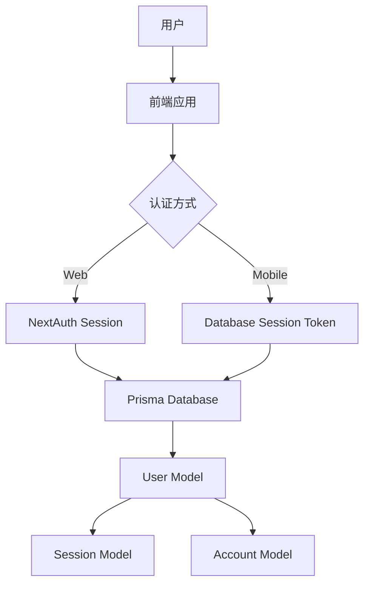

# VSeek 技术文档示例

这是一个展示 **VSeek** 项目中各种 Markdown 功能的示例页面。

## 🚀 项目概述

VSeek 是一个基于 Next.js 和 NextAuth.js 的现代化 Web 应用程序，具有以下特性：

- ✅ **统一认证系统** - 支持 JWT 和 Session 双重策略
- ✅ **OAuth 集成** - Google、GitHub、微信登录
- ✅ **移动端支持** - 数据库 Session Token 方案
- ✅ **现代化 UI** - 基于 Tailwind CSS 和 shadcn/ui

## 📊 技术架构

### 认证系统架构图



### 数据库设计

```sql
-- 用户表
CREATE TABLE "User" (
  "id" TEXT NOT NULL,
  "email" TEXT NOT NULL,
  "name" TEXT,
  "password" TEXT,
  "role" "UserRole" NOT NULL DEFAULT 'USER',
  "isActive" BOOLEAN NOT NULL DEFAULT true,
  "createdAt" TIMESTAMP(3) NOT NULL DEFAULT CURRENT_TIMESTAMP,
  "updatedAt" TIMESTAMP(3) NOT NULL,
  CONSTRAINT "User_pkey" PRIMARY KEY ("id")
);

-- 会话表
CREATE TABLE "Session" (
  "id" TEXT NOT NULL,
  "sessionToken" TEXT NOT NULL,
  "userId" TEXT NOT NULL,
  "expires" TIMESTAMP(3) NOT NULL,
  CONSTRAINT "Session_pkey" PRIMARY KEY ("id")
);
```

## 🔧 代码示例

### TypeScript 接口定义

```typescript
// 用户认证接口
interface AuthenticatedUser {
  id: string;
  email: string;
  name: string;
  role: UserRole;
  isActive: boolean;
}

// 会话令牌响应
interface SessionTokenResponse {
  success: boolean;
  sessionToken: string;
  expiresAt: string;
  user: AuthenticatedUser;
}

// 移动端登录请求
interface MobileLoginRequest {
  email: string;
  password: string;
  deviceInfo?: {
    platform: string;
    version: string;
    model?: string;
  };
}
```

### React Hook 示例

```tsx
import { useSession } from 'next-auth/react';
import { useAuth } from '@features/auth/hooks/use-auth';

export function UserProfile() {
  const { data: session } = useSession();
  const { user, login, logout } = useAuth();

  const handleLogin = async () => {
    try {
      await login('user@example.com', 'password');
      console.log('登录成功');
    } catch (error) {
      console.error('登录失败:', error);
    }
  };

  return (
    <div className="p-4">
      <h2>用户信息</h2>
      {user ? (
        <div>
          <p>欢迎, {user.name}!</p>
          <p>角色: {user.role}</p>
          <Button onClick={logout}>退出登录</Button>
        </div>
      ) : (
        <Button onClick={handleLogin}>登录</Button>
      )}
    </div>
  );
}
```

### API 路由示例

```typescript
// app/api/auth/mobile/login/route.ts
import { NextRequest, NextResponse } from 'next/server';
import { createSession } from '@/lib/auth/session-token';
import { verifyPassword } from '@/lib/auth/auth.service';
import prisma from '@/lib/database/prisma';

export async function POST(request: NextRequest) {
  try {
    const { email, password, deviceInfo } = await request.json();

    // 验证用户凭据
    const user = await prisma.user.findUnique({
      where: { email }
    });

    if (!user || !user.password) {
      return NextResponse.json(
        { success: false, error: 'Invalid credentials' },
        { status: 401 }
      );
    }

    const isValidPassword = await verifyPassword(password, user.password);
    if (!isValidPassword) {
      return NextResponse.json(
        { success: false, error: 'Invalid credentials' },
        { status: 401 }
      );
    }

    // 创建会话令牌
    const session = await createSession(user.id, deviceInfo);

    return NextResponse.json({
      success: true,
      sessionToken: session.token,
      expiresAt: session.expiresAt.toISOString(),
      user: {
        id: user.id,
        email: user.email,
        name: user.name,
        role: user.role,
        isActive: user.isActive
      }
    });
  } catch (error) {
    console.error('Mobile login error:', error);
    return NextResponse.json(
      { success: false, error: 'Internal server error' },
      { status: 500 }
    );
  }
}
```

## 📋 功能特性对比

| 特性 | Web 版本 | Mobile 版本 | 说明 |
|------|----------|-------------|------|
| 认证方式 | NextAuth Session | Database Token | 不同策略适应不同平台 |
| 会话时长 | 7 天 | 30 天 | 移动端更长会话时间 |
| 令牌生成 | NextAuth 自动 | crypto.randomBytes | 自定义安全令牌 |
| 撤销能力 | ✅ | ✅ | 支持主动撤销会话 |
| 多设备支持 | ✅ | ✅ | 支持多设备同时登录 |

## 🎯 最佳实践

### 1. 安全考虑

> **重要提示**: 在生产环境中，请确保：
> - 使用 HTTPS 传输
> - 定期轮换密钥
> - 监控异常登录行为
> - 实施速率限制

### 2. 性能优化

```typescript
// 使用 React.memo 优化组件渲染
const OptimizedUserCard = React.memo(({ user }: { user: User }) => {
  return (
    <Card>
      <CardContent>
        <h3>{user.name}</h3>
        <p>{user.email}</p>
      </CardContent>
    </Card>
  );
});

// 使用 useMemo 缓存计算结果
const expensiveValue = useMemo(() => {
  return heavyCalculation(data);
}, [data]);
```

### 3. 错误处理

```typescript
// 全局错误处理
export function GlobalErrorHandler() {
  useEffect(() => {
    const handleError = (error: ErrorEvent) => {
      console.error('Global error:', error);
      // 发送错误报告到监控服务
    };

    window.addEventListener('error', handleError);
    return () => window.removeEventListener('error', handleError);
  }, []);

  return null;
}
```

## 🔗 相关链接

- [NextAuth.js 官方文档](https://next-auth.js.org/)
- [Prisma 数据库文档](https://www.prisma.io/docs)
- [Tailwind CSS 样式指南](https://tailwindcss.com/docs)
- [shadcn/ui 组件库](https://ui.shadcn.com/)

## 📝 更新日志

### v1.2.0 (2024-01-15)
- ✨ 新增移动端 Session Token 支持
- 🔧 优化认证中间件性能
- 🐛 修复 OAuth 账户关联问题

### v1.1.0 (2024-01-10)
- ✨ 统一认证系统架构
- 🔧 重构 API 路由结构
- 📚 完善技术文档

### v1.0.0 (2024-01-01)
- 🎉 初始版本发布
- ✨ 基础认证功能
- ✨ OAuth 登录支持

---

*最后更新: 2024年1月15日*
*文档版本: v1.2.0*
